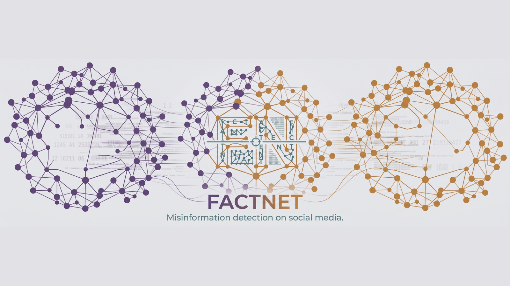
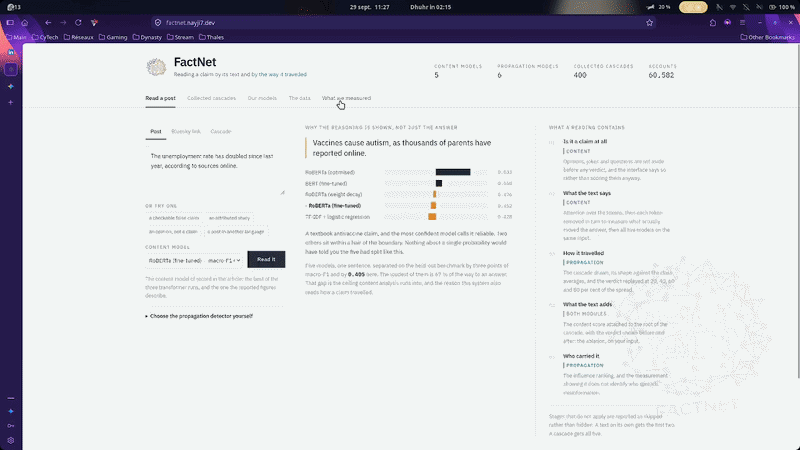
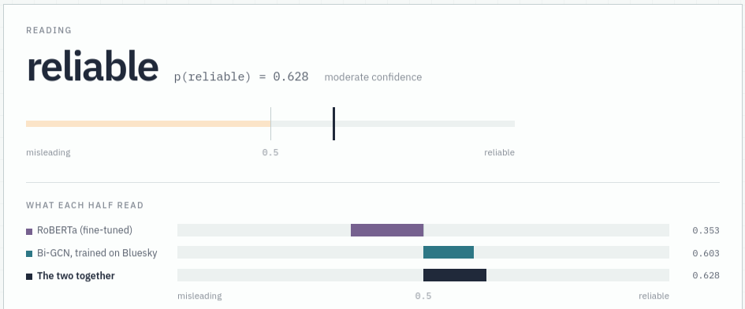
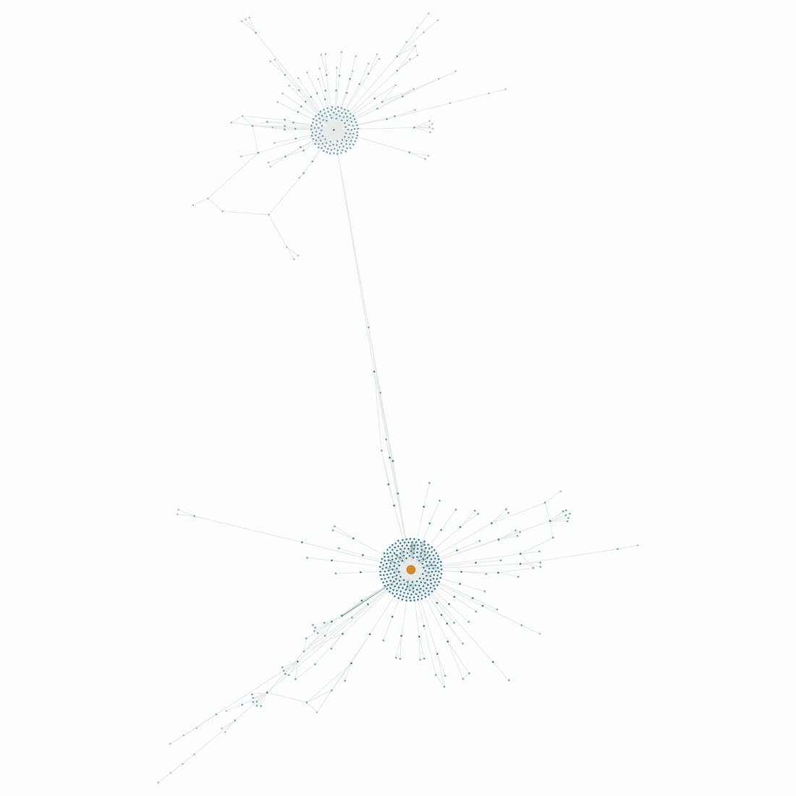

<p align="center">
  
</p>

<p align="center">

[](https://factnet.nayji7.dev)
[](https://www.python.org/)
[](https://pytorch.org/)
[](https://pyg.org/)
[](https://huggingface.co/NayJi7/factnet-models)
[](LICENSE)
[](https://doi.org/10.5281/zenodo.23015281)
[](https://doi.org/10.5281/zenodo.23014908)

</p>

<p align="center"><em>Is misinformation recognised by what it says, or by how it spreads? FactNet reads both.</em></p>

<p align="center"><strong>Try it live: <a href="https://factnet.nayji7.dev">factnet.nayji7.dev</a></strong></p>

<p align="center">
  
</p>

# FactNet - Misinformation Detection on Social Media

> Two independent detectors, one reading the text of a post and one reading the cascade of people who shared it, joined at a single integration point and served through an interactive dashboard.

## About FactNet

FactNet was built during a research internship at the Faculty of Computer Science and Information Technology of **Universiti Malaya** (Kuala Lumpur, June to August 2026) by four engineering students from **CY Tech**.

The system has two modules that run on their own:

- a **content module** that classifies a post as reliable or misleading from its wording, with fine-tuned language models,
- a **propagation module** that classifies the cascade of reshares behind a post, with graph neural networks, and ranks the accounts that drive it.

The content score can be handed to the propagation module as a feature of the root of the cascade. Both modules were trained on public benchmarks, then carried onto 400 cascades collected from Bluesky to see what survives outside the benchmark.

## Screenshots

<table>
  <tr>
    <td align="center" width="50%"></td>
    <td align="center" width="50%"></td>
  </tr>
  <tr>
    <td align="center"><sub>One Bluesky cascade read by both modules</sub></td>
    <td align="center"><sub>A collected cascade: the source in orange, two hubs of reshares</sub></td>
  </tr>
</table>

## Key Features

### Content module
- **Model comparison under one protocol**: TF-IDF with logistic regression, frozen DistilBERT, fine-tuned BERT and three RoBERTa variants
- **Check-worthiness gate**: explicit rules that set aside opinions, jokes and questions before any verdict
- **Explanations**: attention and leave-one-out occlusion, showing which words a verdict rests on
- **Generalisation tests**: held-out topics and full news articles

### Propagation module
- **Graph detectors**: GCN, GAT and Bi-GCN on the UPFD benchmark (PolitiFact, GossipCop)
- **Early detection**: the same models evaluated on the first 20, 40, 60 and 80% of each cascade
- **Influence scoring**: reach, PageRank and k-core combined into one ranking, checked against seven other weightings
- **Edgeless baselines and controls**: what a detector scores when every edge is removed, or when only the cascade size is known

### Real-world data
- **Bluesky collector**: cascades fetched through the AT Protocol, with authenticated access
- **Source-based labelling**: posts labelled by the published credibility of the outlet they link to (Iffy Index)
- **Anonymised export**: every account replaced by a stable pseudonym before anything is shared

### Dashboard
Hosted at [factnet.nayji7.dev](https://factnet.nayji7.dev).
- **Paste a post** to get the content verdict, or **paste a Bluesky link** to collect its cascade live
- Cascade drawing, hop distances, influence ranking and the verdict of every model, side by side
- Results and data views over every experiment, built from the files the experiments wrote

## Results

Macro-F1, mean of three seeds. Full tables and controls are in the [technical reports](#publications).

| Setting | Model | Macro-F1 |
|---|---|---|
| UPFD PolitiFact | Bi-GCN | 0.832 |
| UPFD GossipCop | Bi-GCN | 0.920 |
| UPFD GossipCop | Logistic regression, no edges | 0.940 |
| UPFD GossipCop, first 20% of each cascade | Bi-GCN | 0.900 |
| LIAR short claims | Every content model | about 0.63 |
| Full news articles | Content classifier | 0.805 / 0.735 |
| Bluesky, trained on Twitter | Bi-GCN | 0.768 |
| Bluesky | One-parameter rule on cascade size | 0.902 |

The two reports read these numbers in detail: a simple baseline matches the graph model on GossipCop, the text of a short claim caps every content model, and transfer from Twitter to Bluesky does not hold.

## Tech Stack

### Models and experiments
| Technology | Purpose |
|------------|---------|
| **PyTorch** | Training and inference |
| **PyTorch Geometric** | Graph neural networks, UPFD loading |
| **Hugging Face Transformers** | BERT and RoBERTa fine-tuning |
| **scikit-learn** | TF-IDF and logistic regression baselines |
| **NetworkX** | PageRank, k-core, cascade statistics |
| **Kaggle GPUs** | Transformer fine-tuning (see `notebooks/`) |

### Serving
| Technology | Purpose |
|------------|---------|
| **FastAPI + Uvicorn** | Inference API, streamed stage by stage |
| **React 19 + TypeScript** | Dashboard |
| **Vite + Tailwind CSS** | Front-end build and styling |
| **react-force-graph, Recharts** | Cascade drawing and result charts |
| **Docker + nginx** | Single hardened container behind a reverse proxy |

## Architecture

```
                 ┌───────────────────────────┐
  post text ───▶ │  Content module (nlp/)    │──── content verdict
                 │  check-worthiness gate    │
                 │  BERT / RoBERTa / TF-IDF  │
                 └─────────────┬─────────────┘
                               │ content score, written on the root node
                               ▼
  Bluesky link ─▶ ingestion/ ─▶┌───────────────────────────┐
  (live cascade)               │  Propagation module       │──── structural verdict
                               │  (graph/)                 │
                               │  GCN / GAT / Bi-GCN       │──── influence ranking
                               └───────────────────────────┘
                                             │
                               serve/ (FastAPI) ──▶ web/ (React dashboard)
```

## Project Structure

```
src/factnet/
  ingestion/   Bluesky collection, labelling, anonymisation, graph conversion
  nlp/         content models, check-worthiness, explanations, generalisation
  graph/       graph detectors, early detection, influence, controls
  serve/       FastAPI engine behind the dashboard
  viz/         Streamlit cascade viewer
web/           React dashboard
notebooks/     GPU runs (transformer fine-tuning, BERT features, integration)
tests/         pytest suite
deploy/        server scripts and nginx configuration
data/results/  every measurement the reports quote, with its seeds
docs/papers/   the two technical reports
```

## Getting Started

### Prerequisites
- [uv](https://docs.astral.sh/uv/) and Python 3.11
- [Bun](https://bun.sh/) for the dashboard
- Docker, only for the containerised deployment

### Install

```bash
git clone https://github.com/NayJi7/FactNet.git
cd FactNet
uv sync
```

The benchmarks download themselves on first use: UPFD through PyTorch Geometric, LIAR from its original source.

### Models and sample data

The trained weights and the anonymised Bluesky sample are on [Hugging Face](https://huggingface.co/NayJi7/factnet-models):

```bash
uvx --from huggingface_hub hf download NayJi7/factnet-models --local-dir hf-models
mv hf-models/data/samples.jsonl data/
mkdir -p data/raw/bluesky && mv hf-models/data/raw/bluesky/*.jsonl data/raw/bluesky/
rm -rf hf-models/data && mv hf-models/* models/ && rm -rf hf-models
```

The models trained on CPU can also be rebuilt locally:

```bash
uv run python -m factnet.serve.build
```

### Run the dashboard

```bash
(cd web && bun install)
./run-dashboard.sh
```

The engine starts on `127.0.0.1:8000` and the interface on `127.0.0.1:5173`. Pasting a Bluesky link needs an app password, set in `BSKY_IDENTIFIER` and `BSKY_APP_PASSWORD`. Everything else works without it.

For a server, see [`deploy/README.md`](deploy/README.md): one container, `docker compose up -d --build`.

### Run the experiments

Each experiment runs as a module, for example:

```bash
uv run python -m factnet.graph.train_upfd          # graph detectors on UPFD
uv run python -m factnet.graph.early_detection     # truncated cascades
uv run python -m factnet.graph.trivial_baselines   # edgeless baselines
uv run python -m factnet.nlp.baseline              # TF-IDF and frozen transformer
uv run python -m factnet.nlp.generalisation        # held-out topics
```

The measurements quoted in the reports are kept in `data/results/`, with their seeds.

### Tests

```bash
uv run pytest
uv run ruff check
```

## Publications

Both reports are published on Zenodo, and the PDFs are in [`docs/papers/`](docs/papers/).

- **Propagation Structure as a Signal for Misinformation Detection with Graph Neural Networks and Edgeless Baselines** (Technical Report). [doi:10.5281/zenodo.23015281](https://doi.org/10.5281/zenodo.23015281)
- **Content-Based Misinformation Detection on Short Claims and Full News Articles** (Technical Report). [doi:10.5281/zenodo.23014908](https://doi.org/10.5281/zenodo.23014908)

```bibtex
@techreport{terrak2026propagation,
  title  = {Propagation Structure as a Signal for Misinformation Detection with Graph Neural Networks and Edgeless Baselines},
  author = {Terrak, Adam and El Harsal, Abdelah and Ouguerd, Ayman and Saghir, Louaye and Hamid, Suraya and Abdul Ghani, Norjihan},
  year   = {2026},
  institution = {Zenodo},
  doi    = {10.5281/zenodo.23015281}
}

@techreport{terrak2026content,
  title  = {Content-Based Misinformation Detection on Short Claims and Full News Articles},
  author = {Terrak, Adam and Ouguerd, Ayman and El Harsal, Abdelah and Saghir, Louaye and Abdul Ghani, Norjihan and Hamid, Suraya},
  year   = {2026},
  institution = {Zenodo},
  doi    = {10.5281/zenodo.23014908}
}
```

## Data and Ethics

The Bluesky sample shared here is anonymised: every account is a pseudonym and every mention or link inside a post is masked. The post text is kept, since it is what the content models classify. The raw collection with account identities is not distributed.

## License

[MIT](LICENSE)

## Authors

**Adam Terrak** - [@NayJi7](https://github.com/NayJi7)
**Abdelah El Harsal** - [@abdel95j](https://github.com/abdel95j)
**Ayman Ouguerd** - [@aymanouguerd](https://github.com/aymanouguerd)
**Louaye Saghir** - [@Lyeryne](https://github.com/Lyeryne)

Supervised by Dr Suraya Hamid and Dr Norjihan Abdul Ghani, Faculty of Computer Science and Information Technology, Universiti Malaya.
